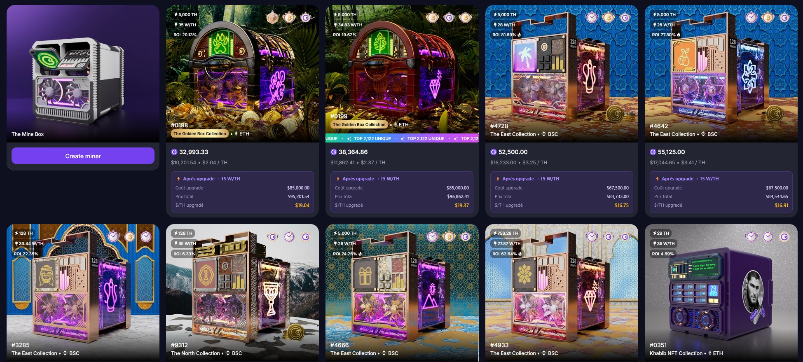

# GoMining Companion

Analyse et enrichit le marketplace GoMining en affichant des métriques de coût d'upgrade directement sur chaque NFT :
coût total pour passer à 15 W/TH, prix total upgradé, et prix par TH upgradé.

## Installation

### Chrome

1. Ouvre `chrome://extensions/`
2. Active le **Mode développeur** (coin supérieur droit)
3. Clique sur **Charger l'extension non empaquetée**
4. Sélectionne le dossier du projet

### Firefox

1. Ouvre `about:debugging#/runtime/this-firefox`
2. Clique sur **Charger un module complémentaire temporaire…**
3. Sélectionne le fichier `manifest.json` du projet

## À propos des conditions d'utilisation

Les CGU de GoMining interdisent la collecte automatisée de données (scraping, parsing). Cette extension parse le DOM du marketplace pour calculer des métriques, ce qui pourrait techniquement relever de cette clause.

En pratique, l'extension est **100% locale et read-only** : aucune donnée stockée ou transmise, aucune automatisation d'actions. Elle ne crée aucune charge sur les serveurs de GoMining.

Pour afficher les prix live (BTC / GOMINING) du simulateur de rendement, l'extension **observe les appels API** que l'application effectue déjà (`/api/exchanges/getPrice`, `/api/exchanges/getTokenPrice`) en les écoutant dans la page — sans requête supplémentaire. En cas d'échec de l'observation (CSP, appels déjà passés), elle peut effectuer au plus une requête légère vers ces mêmes endpoints publics, sans données personnelles. Libre à toi de l'utiliser en connaissance de cause.
