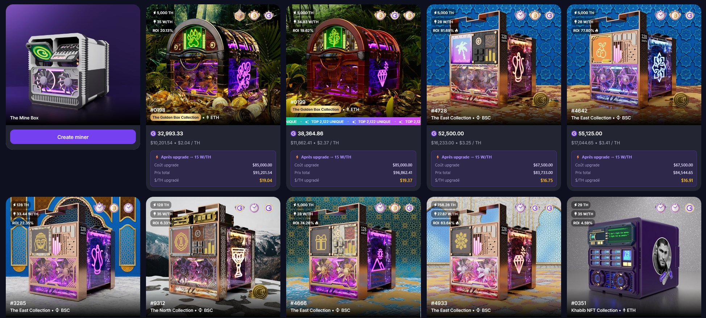

# GoMining Companion

Analyse et enrichit le marketplace GoMining en affichant des métriques de coût d'upgrade directement sur chaque NFT :
coût total pour passer à 15 W/TH, prix total upgradé, et prix par TH upgradé.

Sur la page détail d'un mineur, un panneau ajoute un calculateur d'upgrade complet, un simulateur de rendement (prix
BTC/GOMINING live) et, pour les machines de la collection *The Greedy Machines*, un simulateur d'évolution de puissance
(upgrade hebdomadaire selon les votes veGOMINING).

## Fonctionnalités

### Marketplace
- **Badge enrichi sur chaque carte** : coût d'upgrade vers 12 / 15 W/TH, prix total upgradé et prix par TH upgradé (mention « déjà optimal » sous 12 W/TH).
- **Raccourcis de filtres** : boutons injectés dans la barre de filtres, même style que les natifs. Le bouton **➕** enregistre la page/filtre courant comme raccourci (emoji + nom, modifiables, supprimables), persisté dans l'extension. Clic = navigation sans rechargement quand l'app suit, sinon rechargement ; l'état actif suit les changements de filtres manuels.

### Page détail d'un mineur
- **Calculateur d'upgrade complet** : efficience cible, coût / TH, prix total upgradé, stratégies « Eff. → Puissance » et « Puissance → Eff. », prix d'achat éditable pour les mineurs non en vente (rentabilité, ROI, délai de récupération).
- **Simulateur de rendement** : paramètres BTC, sats/TH/jour, kWh, remise maintenance ; prix live BTC / GOMINING captés depuis l'app, devise de maintenance au choix.
- **Simulateur Greedy Machines** : évolution de puissance hebdomadaire (votes veGOMINING) avec option de réinvestissement des gains en TH et détail Greedy vs réinvestissement.

### Popup
- **Coûts d'upgrade éditables** par palier W/TH (avec rétablissement des défauts) et recalcul à la demande.
- **Écoute des upgrades** : capture les paliers de coûts réels au fil de la navigation, par efficience.
- Sélecteur de langue (FR/EN) et accès aux outils.

### Outils (dashboard)
- **Simulateur de réinvestissement** : compare la stratégie « réinvestir les gains en TH puis retirer » à la stratégie classique, en table et en graphique (puissance, patrimoine, net cumulé), avec option Greedy Machines.

L'ensemble est **100 % local** (aucune donnée transmise) et disponible en **français et anglais**.

## Installation

### Chrome

1. Ouvre `chrome://extensions/`
2. Active le **Mode développeur** (coin supérieur droit)
3. Clique sur **Charger l'extension non empaquetée**
4. Sélectionne le dossier du projet

### Firefox

1. Ouvre `about:debugging#/runtime/this-firefox`
2. Clique sur **Charger un module complémentaire temporaire…**
3. Sélectionne le fichier `manifest.json` du projet

## À propos des conditions d'utilisation

Les CGU de GoMining interdisent la collecte automatisée de données (scraping, parsing). Cette extension parse le DOM du marketplace pour calculer des métriques, ce qui pourrait techniquement relever de cette clause.

En pratique, l'extension est **100% locale et read-only** : aucune donnée stockée ou transmise, aucune automatisation d'actions. Elle ne crée aucune charge sur les serveurs de GoMining.

Pour afficher les prix live (BTC / GOMINING) du simulateur de rendement, l'extension **observe les appels API** que l'application effectue déjà (`/api/exchanges/getPrice`, `/api/exchanges/getTokenPrice`) en les écoutant dans la page — sans requête supplémentaire. En cas d'échec de l'observation (CSP, appels déjà passés), elle peut effectuer au plus une requête légère vers ces mêmes endpoints publics, sans données personnelles. Libre à toi de l'utiliser en connaissance de cause.
